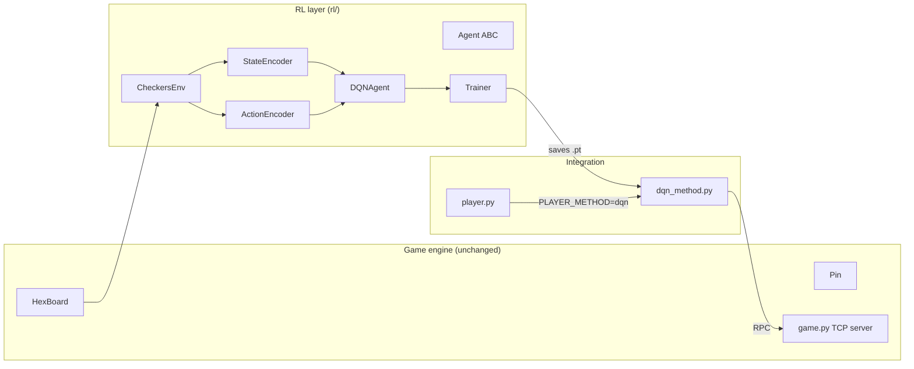

# RL Chinese Checkers — Architecture

This document explains how the RL framework is wired together, what data
flows through it, and why. Read `training_guide.md` for the actual
commands to train and evaluate agents.

## High-level view

The repository has three independent layers:

1. **Game engine** — the existing `HexBoard` / `Pin` classes and the
   TCP server. This is what the tournament uses. We do not change it.
2. **RL layer** — an in-process Gym-style environment, observation /
   action encoders, agents, and a curriculum trainer. Lives under
   `rl/`.
3. **Integration** — `multi system single machine minimal/dqn_method.py`
   exposes the trained model to `player.py` through the same interface
   as `alphazero_method.py`. This is the bridge that lets an agent
   trained fully in-process compete in the real server-hosted tournament.



## Directory layout

```
rl/
  __init__.py
  game_bridge.py          Imports HexBoard/Pin across the whitespace path
  env/
    checkers_env.py       CheckersEnv (solo_race + multi modes)
  encoding/
    state_encoder.py      (16, 121) tensor
    action_encoder.py     Flat action index + legal-move mask
  agents/
    base.py               Agent ABC + Transition
    random_agent.py
    greedy_agent.py       Distance-reduction heuristic (baseline / warmup)
    dqn_agent.py          Double-DQN with action masking
  networks/
    dqn_net.py            MLP Q-network
  training/
    replay_buffer.py      Uniform buffer (packed masks)
    metrics.py            CSV + matplotlib summary
    trainer.py            Curriculum driver
  configs/
    dqn_default.json      Full training config
    dqn_quicktest.json    Short config for smoke-testing
  scripts/
    train_dqn.py          CLI: train
    eval_agent.py         CLI: evaluate / render
  checkpoints/            Saved models + metrics/
  tests/                  Unit tests
```

## Observation encoding (StateEncoder)

We always encode the board from the *agent's* perspective so the same
network weights work regardless of which colour the agent is assigned
at tournament time. The shape is `(16, 121)` flattened to 1936 floats:

| Channel | Meaning                                                                 |
| ------: | ----------------------------------------------------------------------- |
|       0 | Any of my pins                                                          |
|       1 | Any opponent pin (aggregated over all opposing colours)                 |
|       2 | My goal zone (cells whose `postype` is my opposite colour)              |
|       3 | My start zone (cells whose `postype` equals my colour)                  |
|       4 | Empty cell                                                              |
|       5 | `move_count / max_moves` broadcast over every cell                      |
|    6-15 | Per pin_id: channel `6+i` marks where *my* pin with id `i` currently is |

Channels 6-15 are important: legal moves are indexed by `pin_id`, yet
pins of the same colour are interchangeable from the game rules'
perspective. Without those channels the network has no way to know
"which of my pins is pin_id 3", and it has to learn a redundant mapping
for every (pin_id, destination) pair. With them, `Q(s, pin_id, dest)`
can rely directly on the spatial feature of pin_id's current cell.

## Action space and masking (ActionEncoder)

Action = `(pin_id, to_index)` encoded to a flat index:

```
flat = pin_id * NUM_CELLS + to_index     # range [0, 10*121) = [0, 1210)
```

At every decision point we build a boolean mask of length 1210 from the
legal-moves dict (same shape as `game.get_legal_moves()['legal_moves']`).
Illegal actions are set to `-inf` before argmax so the policy can only
select legal moves. During Bellman target computation, the next state's
mask is applied as well — a necessary correction in masked-action DQN
that many implementations skip.

### Move-ranking + top-k

`ActionEncoder` also provides lightweight heuristic ranking for legal
actions. When enabled (`agent.use_topk_legal=true`), `DQNAgent` only
considers the top-k legal actions (by heuristic score) for sampling and
argmax. This reduces effective branching early in training.

## Environment (CheckersEnv)

Two modes, same API:

- `solo_race`: a single colour on the board, no opponents. Used for
  the first curriculum stage ("learn the racing skill before worrying
  about opponents").
- `multi`: 2-6 colours, one of them is the agent, the rest are driven
  by `opponent_policies` callbacks. `env.step()` internally plays every
  non-agent turn before returning control, so from the agent's
  perspective every `step()` is one full round.

The env reuses `HexBoard`/`Pin` directly — `Pin.getPossibleMoves()` is
the single source of truth for move legality. The env applies moves
manually (without `Pin.placePin`) to avoid the debug prints that the
original method emits. Roughly 2000 env steps/second on CPU (pure Python).

### Reward design

Potential-based shaping on top of sparse terminal rewards:

```text
reward = -step_penalty                                 # per step
       + distance_shaping * (d_old - d_new)            # dense, telescoping
       + per_pin_home * max(0, pins_home_delta)        # sparse, monotonic
       + all_home_bonus                                # terminal (win)
       + win_bonus  / lose_penalty                     # multi mode
```

`pins_home_delta` is clamped to positive values with a monotonic
``_last_pins_home``, preventing a pin-cycling exploit where a pin
enters and leaves the goal to farm +reward.

The telescoping distance shaping is an approximation of
`phi(s') - phi(s)` with `phi(s) = -total_goal_distance(s)`. Cumulative
sum over an episode is bounded by initial total distance, so it cannot
dominate the terminal reward if tuned properly.

## DQN agent

Double-DQN with action masking, Huber loss and a separate target
network. Relevant details:

- `act(obs, mask, training)`: epsilon-greedy during training, pure
  argmax-over-masked-Q during evaluation and inference.
- `observe(Transition)`: pushes to replay buffer and triggers `_learn`
  every `train_freq` environment steps (after `learn_starts` warmup).
- `_learn`: samples a batch, computes `Q(s, a)` from the online net,
  uses online to pick action / target to evaluate it for the bootstrap
  target (double DQN), then Huber-loss on `r + gamma * (1-done) * Q_next`.
  Target net is copied every `target_update_interval` training steps.
- Replay supports both uniform and PER (priority-weighted sampling with
  importance weights).
- Optional n-step return (`n_step > 1`) aggregates short reward horizons
  before insertion into replay.

Default network: `MLP [1936 -> 256 -> 256 -> 1210]` with ReLU. Small
enough to train quickly on CPU/GPU within our 1-hour budget, large
enough to represent the 121-cell spatial relationships.

## Curriculum

Stage 1 — `solo_race`. Teach the agent to move pins to the goal without
an opponent stealing cells. Stops early when rolling win-rate over the
last 100 episodes crosses `exit_win_rate` (default 0.90). Warmup:
~60 greedy-driven episodes to prime the replay buffer before epsilon
decays.

Stage 2 — `vs_random` (2-player). Build on the solo policy; now a
random opponent occupies the opposite-colour base (red vs blue).
Terminal reward now includes `win_bonus` and `lose_penalty`, so the
agent has a reason to finish quickly.

## GPU profiles (local vs server)

`train_dqn.py` supports automatic hardware-aware config scaling:
- `v100` profile if CUDA device name contains `V100`,
- `default_cuda` for other CUDA GPUs,
- `cpu_fallback` without CUDA.

Profiles can override selected config fields (`agent.batch_size`,
episode counts, etc.) without changing the base experiment JSON.

## Integration with `player.py`

`dqn_method.py`:

1. Lazy-loads the checkpoint on first call (falls back to random if
   weights aren't present; important so `run_game.py --method dqn` is
   not a hard error before training is done).
2. Reuses the exact same `StateEncoder` / `ActionEncoder` used in
   training, fed the server's JSON `state["pins"]` and the server's
   `legal_moves` dict — so inference-time distribution matches training.
3. Returns `(pin_id, to_index, delay)` identical to
   `alphazero_method.py`.

`player.py` was extended with a `"dqn"` whitelist entry and a small
dispatcher. `run_game.py` accepts `--method dqn`. Server code
(`game.py`) is completely untouched.

## Design decisions / trade-offs

- **In-process training over server training**: TCP RPC + per-turn
  timeout = ~10 moves/second. In-process is ~2000/sec — we need that
  difference to fit training in an hour.
- **Flat action space over factored**: simpler to mask, simpler to
  implement DQN against, and 1210 actions is manageable.
- **Masking over penalty for illegal actions**: penalty-based
  approaches (`r = -1 for illegal`) wastes exploration. Masking
  forces legal play by construction.
- **Greedy warmup over pure random warmup**: greedy produces
  episodes where pins actually reach the goal, so the replay buffer
  contains at least a handful of positive-reward trajectories before
  training starts.
- **MLP over CNN/GNN**: 121 cells is small; the geometric structure
  is already encoded through the per-cell channels. MLP trains
  fastest and is simplest to debug.
